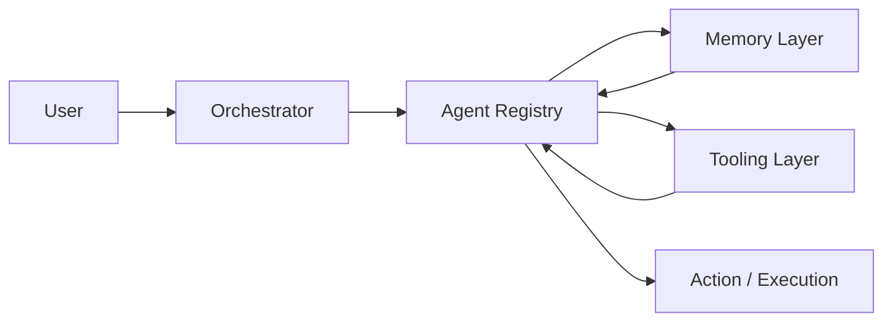

# David Garzón - AI-Native Product Leader
### AI-Native Systems Architect

I design and build AI-first systems.

AI-native product & platform architect.  
Former VP Product & Technology.  
Builder of multi-agent platforms, scoring engines and intelligent SaaS infrastructures.

Barcelona 🇪🇸

---

## What I Actually Do

I don’t ship features.  
I design systems.

- Multi-agent AI orchestration (LLM-driven execution layers)
- Decision & scoring engines (structured + unstructured signals)
- SaaS platform blueprints (multi-tenant, RBAC, event-driven)
- AI-native product discovery & prioritization frameworks
- Automation systems across marketing, sales & operations

AI is not an add-on.  
It is the core primitive.

---

## Current Open Work

🔹 **multi-agent-business-operator**  
Modular framework for orchestrating specialized AI agents with memory and tool registries.

🔹 **digital-presence-score-engine**  
Weighted scoring model transforming digital signals into executable intelligence.

🔹 **saas-platform-blueprint**  
Reference architecture for AI-native SaaS platforms.

🔹 **ai-product-discovery-kit**  
LLM-powered system for structured product discovery and prioritization.

🚧 Work in progress — repositories will progressively become public.

---

## Architecture Principles

- Platform > Feature
- AI as Infrastructure
- Systems Thinking over Roadmap Thinking
- Memory-Driven Agents
- Observable & Measurable Intelligence
- Business Impact > Technical Novelty

---

## Stack

Python · FastAPI · LangGraph · OpenAI · GCP · AWS · Terraform · SQL · Vector DBs

---

## Product Philosophy

AI is not a feature layer.  
It is the execution layer.

Traditional SaaS:

User → UI → Backend → Database

AI-native SaaS:

Intelligence is not an endpoint.  
It is a loop.

AI-native companies are designed around:
- Orchestration
- Memory
- Decision layers
- Autonomous execution cycles

The future is not chatbots.  
It is operational intelligence.

---

## Writing & Thinking

I explore:
- Multi-agent system design
- AI-native organizational models
- Scoring engines & decision automation
- Platform strategy in the LLM era

(Articles coming soon)

---

## Contact

LinkedIn: https://linkedin.com/in/davidgarzon  
Email: davidgarzon@gmail.com

---

*"Build systems that think."*
